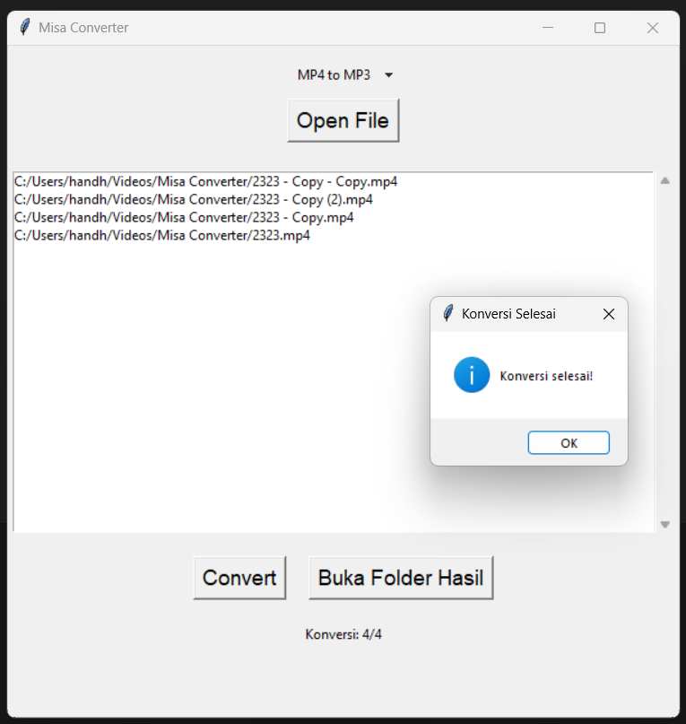
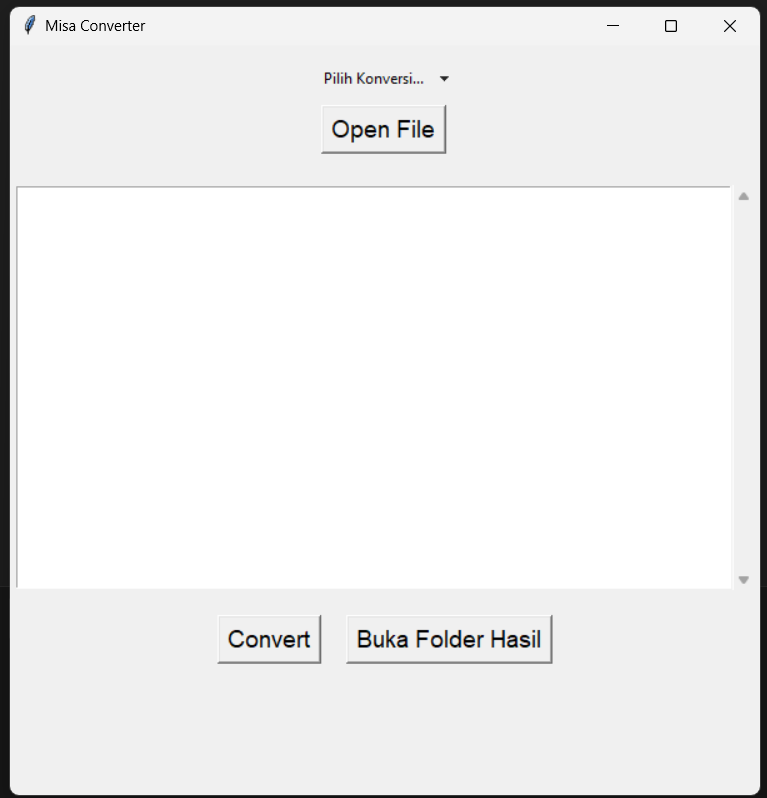

# Misa Converter


Misa Converter adalah program media converter menggunakan FFmpeg dan python.

Ayahku sudah tua dan kesulitan menggunakan aplikasi converter dengan ui kompleks di luar sana, sehingga saya membuatkan program dengan interface yang mudah. Approved by my Father.

>📝 [Catatan]: This software uses libraries from the FFmpeg project under the LGPLv2.1
## Konversi Format yang di support
* MP4 ke MP3
* MKV ke MP3
* AVI ke MP3
* MP4 ke MKV
* MP4 ke AVI
* MKV ke MP4
* MKV ke AVI
* AVI ke MP4
* AVI ke MKV

>📝 [Catatan]: Jika ayahku meminta format lain, aku akan mempertimbangkan menambahkan konversi format lain


## Instalasi

### Menjalankan Langsung Misa_Converter.py

1. **Menginstall Dependencies:**
    ```bash
    pip install -r requirements.txt
    ```

2. **Menjalankan Program:**
    ```bash
    python Misa_Converter.py
    ```

### Membuat Executable untuk Windows

1. **Menginstall Dependencies:**
    ```bash
    pip install -r requirements.txt
    ```

2. **Menginstall cx_Freeze:**
    ```bash
    pip install cx_Freeze
    ```

3. **Membuat Executable:**
    ```bash
    python setup.py build
    ```
    
4. **Menjalankan Program:**
    Jalankan file Misa_Converter.exe yang ada di folder `..\build\exe.win-amd64-3.11`


>⚠️ **Peringatan**: Misa Converter menggunakan FFmpeg. Pastikan FFmpeg sudah terinstall pada sistem local.

>This software uses code of <a href=http://ffmpeg.org>FFmpeg</a> licensed under the <a href=http://www.gnu.org/licenses/old-licenses/lgpl-2.1.html>LGPLv2.1</a> and its source can be downloaded <a href=link_to_your_sources>here</a>

## Penggunaan


1. Jalankan program
2. klik "Pilih Konversi... ▼" untuk memilih jenis konversi
2. Klik tombol "Open File" untuk memilih file video yang ingin dikonversi 
3. Klik tombol "Convert" untuk memulai konversi
4. Setelah konversi selesai, Anda dapat membuka folder tempat hasil konversi disimpan dengan mengklik tombol "Buka Folder Hasil".

📝 [Catatan]: Folder untuk hasil output yang sudah terkonversi berada pada folder Videos bawaan pada os Windows `C:\Users\...\Videos\Misa Converter`.


